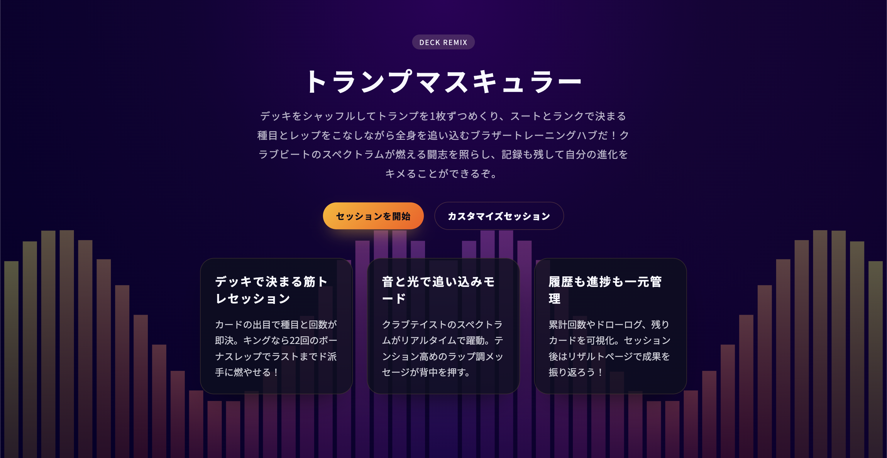
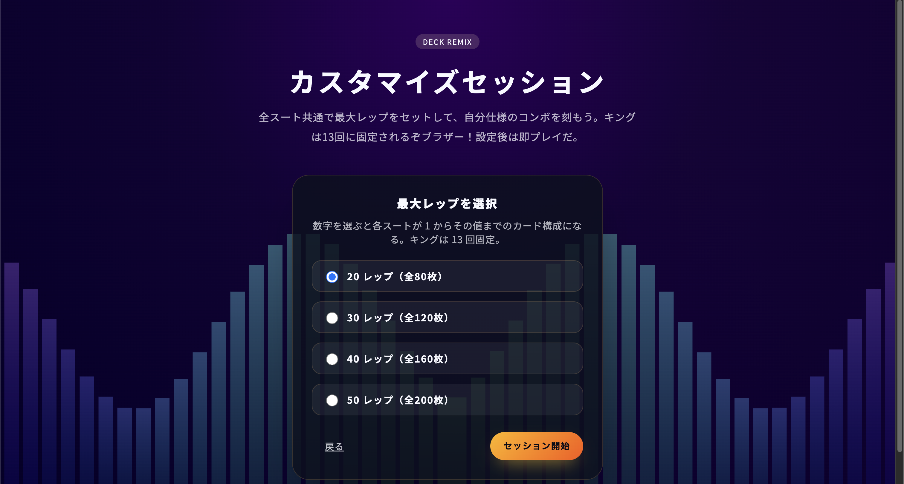
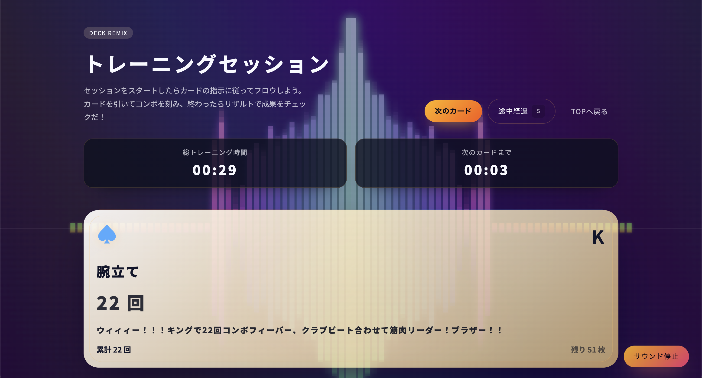
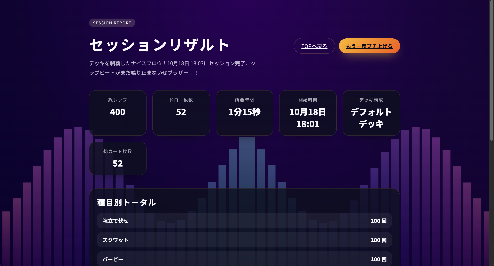

# トランプマスキュラー



|  |  |  |
| --- | --- | --- |

デッキをシャッフル、ビートをチャージ、カードをドローした瞬間からワークアウトがオンビートで走り出す――それが **トランプマスキュラー** だブラザー！！スートとランクで回数が決まり、クラブテイストのスペクトラムが身体と心を煽り立てる。ラップ調ガイダンスでテンションをブチ上げながら、進捗も累計も一発でチェックできるインタラクティブ筋トレアプリだぜ！

## ローカル開発（React SPA 版）

React + TypeScript の SPA として再構築された最新フロー。Vite の開発サーバーで爆速起動だ。

```bash
cd react-app
npm install
npm run dev
```

ブラウザで `http://localhost:5173` を開けば、初期カード自動ドローと BGM が同期した最新プレイグラウンドに突入できる。

### ビルド & プレビュー

```bash
npm run build
npm run preview
```

`react-app/dist` が配信用アセット。任意の静的ホスティングにそのままアップロードできる。

### テスト

デッキ生成ロジックは Vitest で検証中。

```bash
npm run test      # ウォッチ付き
npm run test:run  # CI 用ワンショット
```

## Vercel / デプロイメモ

1. Vercel プロジェクトで **Root Directory** に `react-app` を指定。
2. Build コマンドは `npm run build`、Output は `react-app/dist`。
3. 環境変数は不要。デプロイ後は最新の React SPA が直接ホスティングされるぞ。

## デッキREMIXの主なヴァイブス

- カード 52 枚をシャッフル＆ドロー、種目とレップをライブで提示してテンション MAX
- キングならボーナス 22 回コンボ！クラブビートに合わせてフィニッシュまでノンストップ
- スタートを押した瞬間にビートとともに1枚目を自動ドロー、ノンストップでセッション開始
- スペクトラムが音と連動して虹色にスパーク、筋肉の高鳴りを視覚で感じ取れる（AudioContext + Canvas 対応）
- 累計回数・残りカード・スート別残数・ドローログを同時表示し、計画も反省もリズム良く
- モバイルはカードとドローボタンを固定して、どこでもクラブ級のトレーニングセッション
- TOP → カスタム → トレーニング → リザルトの 4 画面を React Router でシームレス遷移
- セッション中は総トレ時間と「出目＋10秒」のカウントダウンをダブルで表示、追い込みリズムを逃さない
- カスタマイズモードで最大レップを 20 / 30 / 40 / 50 から選択し、キング13回仕様の超ロングセッションも楽しめる

## リポジトリ構成

| パス | ノリノリ解説 |
| --- | --- |
| `react-app/` | メイン実装。Vite + React + TypeScript 版 SPA。音声・タイマー・デッキ管理をフル移植。 |
| `web/` | 旧静的 HTML/JS 版。デザインやフローの参照用に残存（変更なし）。 |
| `card_trainer.rb` | 先代 CLI 版。テキストでもテンションを刻めるレガシーフロウ。 |
| `test/` | 旧デッキ整合性チェック（Ruby / Node）。必要ならレガシー資産として実行可能。 |
| `img/` | README 用スクショや UI のサムネイル置き場。 |
| `handoff.md` | 引き継ぎノート。現況と TODO アイデアをまとめたログ。 |

## レガシー静的版を眺めたいブラザーへ

懐かしの静的バージョンも `web/` に健在。軽く確認したいときは：

```bash
python3 -m http.server 5173 --directory web
# or
npx serve web
```

ブラウザで `http://localhost:5173` にアクセスすれば旧 UI をそのまま再生できる。

## 旧 CLI 版もまだ現役

```bash
ruby card_trainer.rb [--seed=SEED] [--no-color] [--no-bell]
```

端末だけでもトランプマスキュラーの魂は燃える。ラップ調メッセージでテンション継続だ。

CLI 用の Minitest も残してある：

```bash
ruby test/test_deck.rb
```

## グルーヴをさらに磨くアイデア

- スペクトラムテーマのバリエーションやライト演出の強化
- 演目履歴のエクスポート＆SNS シェアで仲間とセッション
- 音源切り替えやカスタムラップメッセージの投入

フィードバックやアイデアが浮かんだら Issue / PR でドロップしてくれ。さあ、デッキを混ぜて、筋肉を爆上げしようブラザー！！
