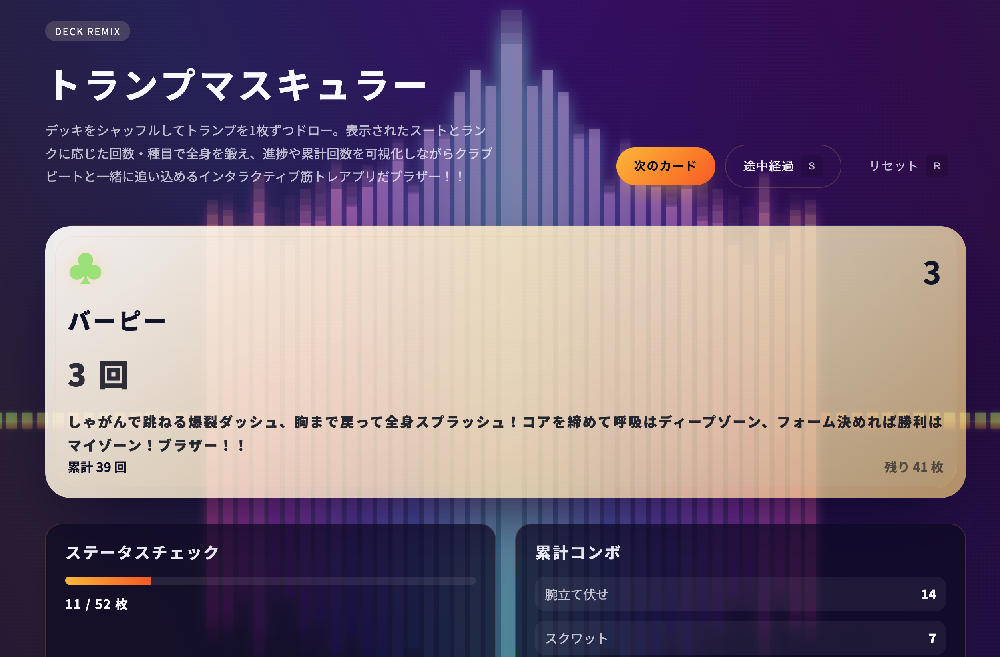

# トランプマスキュラー



デッキをシャッフル、ビートをチャージ、カードをドローした瞬間からワークアウトがオンビートで走り出す――それが **トランプマスキュラー** だブラザー！！スートとランクで回数が決まり、クラブテイストのスペクトラムが身体と心を煽り立てる。ラップ調ガイダンスでテンションをブチ上げながら、進捗も累計も一発でチェックできるインタラクティブ筋トレアプリだぜ！

## デッキREMIXの主なヴァイブス

- カード 52 枚をシャッフル＆ドロー、種目とレップをライブで提示してテンション MAX
- キングならボーナス 22 回コンボ！クラブビートに合わせてフィニッシュまでノンストップ
- スタートを押した瞬間にビートとともに1枚目を自動ドロー、ノンストップでセッション開始
- スペクトラムが音と連動して虹色にスパーク、筋肉の高鳴りを視覚で感じ取れる
- 累計回数・残りカード・スート別残数・ドローログを同時表示し、計画も反省もリズム良く
- モバイルはカードとドローボタンを固定して、どこでもクラブ級のトレーニングセッション
- TOP → トレーニング → リザルトの3ステップ構成で、説明→実践→振り返りをスムーズに回せる
- セッション中は総トレ時間と「出目＋10秒」のカウントダウンをダブルで表示、追い込みリズムを逃さない

## 使い方：ローカルでフロウチェック

静的ファイルだから好きなサーバーで即デプロイ。手っ取り早く試すなら：

```bash
python3 -m http.server 5173 --directory web
# or
npx serve web
```

ブラウザで `http://localhost:5173` にアクセスすると、ビートとともにカードが炸裂するぞ！

## Vercel デプロイ・プレイブック

1. Vercel の新規プロジェクトでこのリポジトリをチョイス。
2. **Framework Preset** は `Other`、**Root Directory** に `web` をセット。
3. Build コマンドも Output も空欄で OK（純静的配信だからね）。
4. デプロイしたら即クラブハウス。`vercel dev` 使うなら `cd web && vercel dev --listen 3000` で試走だ。

## リポジトリ構成

| パス | ノリノリ解説 |
| --- | --- |
| `web/` | フロント一式。HTML/CSS/JS がビートと演出を司る中枢だブラザー！ |
| `card_trainer.rb` | 先代 CLI 版。テキストだけでもリズムに乗れるレガシーフロウ。 |
| `test/` | デッキ整合性チェック用 Minitest。リズムを乱さないための保険だ。 |
| `SPEC.md` | 初代仕様書。原点のビー トを刻む設計メモ。 |
| `version_up.md` | アップデート履歴と未来のプランをメモったロードマップ。 |

## 旧 CLI 版もまだ現役

```bash
ruby card_trainer.rb [--seed=SEED] [--no-color] [--no-bell]
```

端末だけでもトランプマスキュラーの魂は燃える。ラップ調メッセージでテンション継続だ。

## テストでグルーヴを担保

```bash
ruby test/test_deck.rb
```

カード 52 枚のユニークさ、値マッピング、キング 22 回ルールをビシッと検証するぞ。

## 次に刻みたいトラック

- スペクトラムの派生テーマやライティングの強化
- 演目履歴のエクスポート＆SNS シェアで仲間とセッション
- 音源切り替えやカスタムラップメッセージの投入

フィードバックやアイデアが浮かんだら Issue / PR でドロップしてくれ。さあ、デッキを混ぜて、筋肉を爆上げしようブラザー！！
